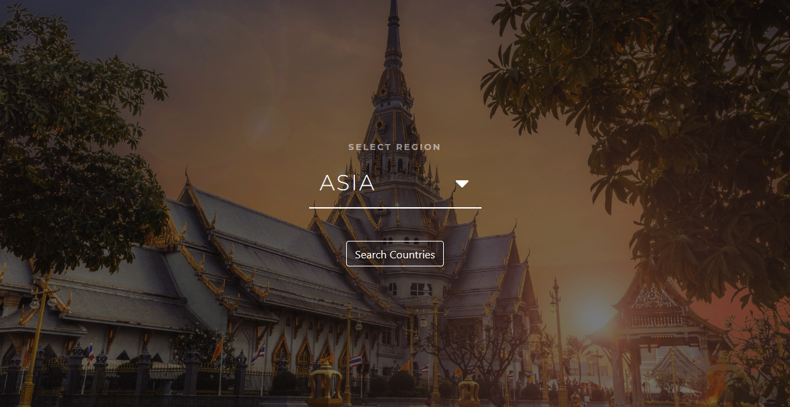
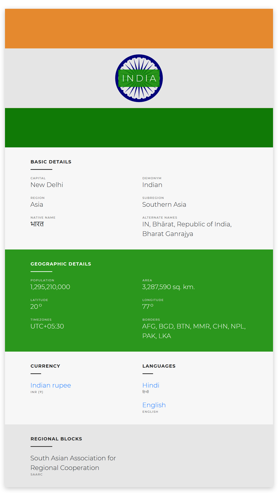

# Countries Info

Get detailed information about all the countries of the world based on major regions, such as Asia, Africa, etc. It also has the feature to filter the countries of a region based on name, languages spoken and currencies used in the country.

[Click here](https://anishghosh103.github.io/CountriesInfoApp/) to check the website.

### Screenshots:

- Home Page:

- Country Details View:

### Built With

- Angular 5
- Bootstrap